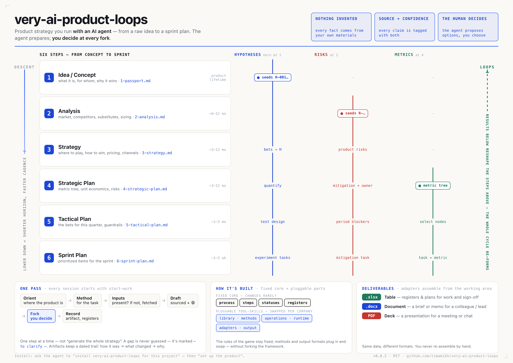

# very-ai-product-loops

**A product-strategy workflow you run *with* an AI agent — from a raw idea to a concrete sprint
plan, without hand-waving.**

The agent does the heavy lifting (research, drafting, bookkeeping) from *your real materials*.
You make the calls at every fork. Nothing is invented; every claim is tagged with where it came
from and how sure we are.

> Idea → Analysis → Strategy → Strategic plan → Tactical plan → Sprint plan — as **nested loops**
> that keep feeding back into each other, not a one-way waterfall.

---

## What is this, in one minute

Most "strategy" lives in slide decks that go stale the day after the offsite. This framework makes
strategy a **living, versioned working area in your repo** that an agent maintains alongside you.

- **Six steps**, from the product's whole-lifetime concept down to the next two-week sprint. Each
  step produces one artifact (a markdown file).
- **Three living registers** — your hypotheses, your risks, your metrics — that are born at the
  step where they first matter and get sharpened as you descend. They are the product's memory.
- **The agent prepares, you decide.** The agent drafts from sources and asks you concise
  questions (2–4 options + a recommended default) at genuine product decisions. It never fills a
  blank with a guess — a gap stays visibly marked `— to clarify —`.
- **Everything is dated and nothing is overwritten.** Every file keeps a change log: how it was →
  what changed → why. You can always see the reasoning, not just the current state.

Who it's for: a PM / founder / CPO who wants to move a product forward with an agent and keep a
trustworthy paper trail — instead of a folder of disconnected docs.

## How you actually work with it

You don't fill templates alone. To begin or resume a session, ask the agent to **start work** (the
`start-work` skill) — it loads the rules and picks up where you left off. A working session looks
like this:

1. You tell the agent what you want to move (e.g. "let's firm up the strategy").
2. The agent orients — reads where the product is, picks the right method, checks it has the
   inputs it needs. If something's missing, it asks you or offers to go get it (draft an interview
   guide, pull metrics).
3. It drafts the section from your real materials, tags every claim with a source and a confidence
   level, and marks its own proposals with ⚙️.
4. At each real product fork it stops and asks you — with options and a recommendation — and waits.
5. It records what changed (the artifact, the registers, the change log) and suggests what's next.

You descend step by step; when something downstream disproves something upstream (a refuted
hypothesis, a changed segment), that signal bubbles back up. That's the "loops" part.

## The six steps

| # | Step | Horizon (~) | You end up with |
|---|------|-------------|-----------------|
| 1 | Concept | product lifetime | `1-concept.md` — what it is, for whom, why it wins |
| 2 | Analysis | ~6–12 mo | `2-analysis.md` — market, competitors, substitutes, sizing |
| 3 | Strategy | ~3–12 mo | `3-strategy.md` — where to play, how to win, pricing, channels |
| 4 | Strategic Plan | ~3–12 mo | `4-strategic-plan.md` — metric tree, unit economics, risks |
| 5 | Tactical Plan | ~1–3 mo | `5-tactical-plan.md` — the bets for this quarter, guardrails |
| 6 | Sprint Plan | ~1–2 wk | `6-sprint-plan.md` — the prioritized items for the next sprint |

Timeframes are indicative — each team moves at its own pace.

## Quickstart

Two separate phases, through **any** AI agent that can read and write files (Claude Code, Codex,
Cursor, a chat window with the repo attached — see
[*Running on an agent other than Claude Code*](install/README.md)):

1. **Install** — point the agent at this repo and ask it to install the framework for your project.
   It vendors the framework (read-only, pinned to a version). No product is set up yet.
2. **Set up the product** — when ready, ask the agent to set up the product. It asks your docs
   language and for your existing materials / links / accesses, files and distributes them, **proposes
   a status** for you to pick, and hands back a summary of what's filled vs open plus where to start.

See [`install/README.md`](install/README.md) for both phases.

Your product docs live in `product-loops/`, kept **separate from your code** so they never interfere with
development. The framework files stay read-only and are updated by bumping the version.

## Architecture — a fixed core + pluggable tool-skills

The framework separates **mechanism from content**. The rules of the game stay fixed; the methods
and how each stage prioritizes them are swappable per company, without forking the framework.

**The fixed core** — the rules and the board; it changes rarely:

- **Process core** (`steps/`) — thin skeleton per step: goal, gate checklist, movement rules, register touchpoints, artifact structure. No methods inside.
- **Registers** — three living, vertical objects: metrics · hypotheses · risks.
- **Statuses** (`statuses/`) — product stages as config (concept-viability · PMF · growth, extensible). See [`statuses/README.md`](statuses/README.md).
- **Rules** (`process/`) — the normative model, loop, conventions, register schemas.

**The pluggable skills** — instruction skills the agent picks up and runs, grouped under [`tool-skills/`](tool-skills/README.md) and swappable per company without forking the core:

- **Library** (`tool-skills/library/`) — product methods as skills: what / when / how / template. See [`tool-skills/library/README.md`](tool-skills/library/README.md).
- **Operations** (`tool-skills/operations/`) — runtime skills for how the agent works: `handoff` (state across a restart), `metrics-capture` (a source → reproducible register rows), `orchestration` (running one pass with subagents). See [`tool-skills/operations/README.md`](tool-skills/operations/README.md).
- **Adapters** (`tool-skills/adapters/`) — the output layer: `to-table` · `to-document` · `to-deck`. Base adapters ship here (neutral); company-specific formats stay external and specialize them. See [`tool-skills/adapters/README.md`](tool-skills/adapters/README.md).

To find a skill for a task, pick the category by phase (produce a section → `library`; render a deliverable → `adapters`; carry state across a restart, go get a number, or split a pass across agents → `operations`); [`tool-skills/README.md`](tool-skills/README.md) has the discovery rule.

**Running a pass with subagents.** When a pass is wider than one context, the lead agent becomes an *orchestrator*: it cuts the work into briefs and checks every return against an acceptance passport before using it. The write rule is a **split**: a `draft` subagent writes exactly one file — its method's worklog (the draft) — while `gather`, `research` and `verify` subagents write nothing and return text. The orchestrator keeps the rest to itself: it **projects** each worklog into the artifact section the human signs, and owns the registers, `state.yaml` and the change log. The rule is canon ([`process/OPERATING-LOOP.md`](process/OPERATING-LOOP.md) → *Delegation*), the procedure is [`tool-skills/operations/orchestration/`](tool-skills/operations/orchestration/SKILL.md), and on Claude Code it is enforced mechanically by the agent definitions in `.claude/agents/` — three carry no write tools, `loops-draft` carries `Write` for its worklog and nothing more. A `delegation: off` in `config.yaml` turns fan-out off entirely; the orchestrator then runs each pass itself.

**What a method claims about its own evidence.** Every library method declares an `evidence_standard`, how much it must generate before it cuts, how it cuts, and whether it must show what it rejected — checked by the linter, so a method cannot quietly stop saying what would make its output wrong. The source-quality rules those declarations point at are in [`tool-skills/library/references/evidence-standards.md`](tool-skills/library/references/evidence-standards.md).

Adapting the framework to your company — a new method, a new stage, different work directions — has one procedure per dial: [`EXTENDING.md`](EXTENDING.md).

**The tooling** — plain scripts over the same files, no dependencies beyond `python3`:

- **Linter** (`tools/lint.py`) — checks the framework's wiring and every instance's registers against the canon; runs in CI.
- **Local console** (`tools/ui/serve.py`) — double-click `tools/ui/console.command` (macOS, Linux) or `console.bat` (Windows), or run `python3 tools/ui/serve.py`, for a browser view of one instance: where the cycle stands, what each gate still has open, the registers, the metric series, every `— to clarify —`, and the change-log timeline. One button saves it as a single self-contained HTML file to send to someone who does not have the folder. **Read-only by design** — a viewer, not an interface to the process: the human asks an agent, the agent writes the files, the console shows what they now say. See [`tools/ui/README.md`](tools/ui/README.md).
- Both read through one shared layer (`tools/loops/`), so the linter and the console can never disagree about what the canon says.

## How data flows

One rule sits under everything: **data lands in a draft first; the polished artifact is a projection of that draft.**

**The documents**
- **Sources** (`sources/`) — raw external material (a founder brief, an export, a report). An archive; never rewritten.
- **Worklog (draft)** — the working document for one method on one step, in the step's folder (e.g. `2-analysis/market-sizing.md`). All the working lives here: the numbers, the reasoning, the rejected options, the open questions. **The source of truth.**
- **Artifact (clean copy)** — the step's output file (e.g. `2-analysis.md`). A **projection** of its worklogs — the conclusion in a fixed, readable shape, holding nothing the worklogs do not. It has two jobs: plain language the human signs off, and a template the console can render.
- **Registers** — the three cross-step tables (hypotheses, risks, metric tree). The home of the IDs everything else references.
- **State** (`state.yaml`) — where the cycle stands, and what the human has signed.

**Who acts**
- **Orchestrator** — the agent holding the human's session. Writes the **artifact, the registers, and state**.
- **Subagent** — a scoped, read-mostly helper the orchestrator briefs. It does the working and writes **its own draft (worklog)** — nothing else: never a register, an artifact, or state, and it never talks to the human.
- **Human** (the product owner) — answers the forks and **signs the artifacts**.

**The three ways data enters**

1. **External material → drafts.** A file is dropped in `sources/` and indexed; the `source-intake` skill then dispatches its facts into the step worklogs that need them (a measured number goes to the metric register, not into prose). A source is cited *in the worklog*, never linked from the artifact.

2. **Method working → draft → artifact.** For a section, the orchestrator either does the working itself or briefs a subagent. Whoever works it writes the **draft (worklog)**; the orchestrator then checks it against the acceptance passport, **projects** the artifact section from the draft (template-shaped, so the console renders it), and shows it to the human. On sign-off the section is committed and the registers, change log and state are updated.

3. **Human in chat.** Where a method has a gap or a fork, the orchestrator asks the human (2–4 options + a recommended default). Nothing lands on disk as a surprise — a section built on reasoning is shown in chat first. At the close of a step the human **signs the artifact sections** (the `theses` skill): the one place "a human approved this version" is recorded.

**Where the linter and the console sit** — across the flow, not inside it:
- **Linter** checks **structure, not meaning**: sections in place, IDs unique, links valid, every method-section backed by a draft, a confirmation marker that is a real date. Meaning is the human's half — the sign-off.
- **Console** is a **read-only window**: it renders the artifacts and registers, and lets you drill from a board into the draft behind a section, and from the draft to its source. There is no write path back.

The links run one way: **board → artifact section → its worklog → (sometimes) a source.** Sources are leaves.

## How the agent reads the repo (for the curious)

An agent working here boots in a fixed order. The rules live in one file, [`AGENTS.md`](AGENTS.md)
(the cross-vendor convention; the root [`CLAUDE.md`](CLAUDE.md) is a pointer to it, because Claude Code
auto-loads that name). It sends the agent through the rules first:

1. [`process/OVERVIEW.md`](process/OVERVIEW.md) — the model and the philosophy it lives by.
2. [`process/OPERATING-LOOP.md`](process/OPERATING-LOOP.md) — the runtime: how one pass of a step runs.
3. [`process/CONVENTIONS.md`](process/CONVENTIONS.md) — notation: confidence tags, sources, IDs, forks, change logs.
4. [`process/REGISTERS.md`](process/REGISTERS.md) — register schemas (hypotheses / risks / metric tree).
5. Then the instance: its `HANDOFF.md` (if present) → `sources/INDEX.md` → only the artifacts the task needs.

`AGENTS.md` is the enforced version of this list — skipping the rules and working from a task
description alone is how they get violated silently. Where an agent auto-loads nothing, the human
points it at that file; the framework never depends on a vendor's boot behaviour.

## Status

Released as **v0.8.0** under the MIT license — usable and open for others to vendor. Built in phases:

- **Phase 0 — Process foundation** → [`process/OVERVIEW.md`](process/OVERVIEW.md) · [operating loop](process/OPERATING-LOOP.md) · [conventions](process/CONVENTIONS.md) _(merged)_
- **Phase 1 — Step/tool/status anatomy + golden exemplar (Step 1, all 4 tools)** _(merged)_
- **Phase 2 — Steps 2–6 skeletons + [register schemas](process/REGISTERS.md) + artifact templates + library fully authored** _(templates + full library done; run-hardening continues)_
- **Onboarding — [`product-setup`](.claude/skills/product-setup/SKILL.md) + [install](install/README.md)** _(merged)_
- **Phase 3 — Agent rules ([AGENTS.md](AGENTS.md)), examples, contribution + versioned branching** _(merged; [contributing](CONTRIBUTING.md) + git tags shipped)_
- **Phase 4 — base [adapters](tool-skills/adapters/README.md) (shipped) · aggregators, automation** _(base adapters done; aggregators/automation later)_

## License

MIT — see [`LICENSE`](LICENSE). Use it, modify it, vendor it into your product's repo; keep the
copyright notice. How to propose changes: [`CONTRIBUTING.md`](CONTRIBUTING.md).
