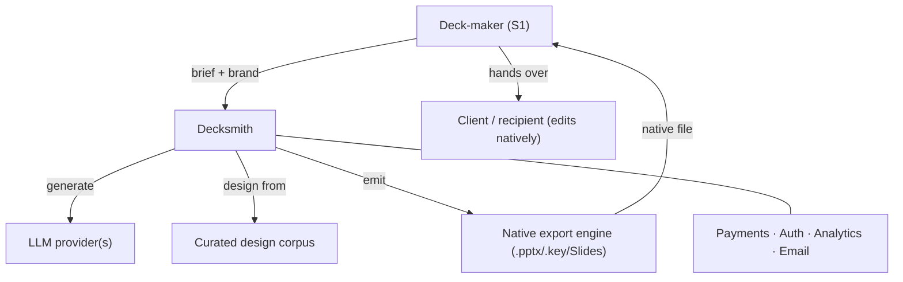

# architecture (C4 Context) — the working

_Source of truth for `3-strategy.md#architecture`. Lens: C4 model (Simon Brown), **Context level
only** — the system, its users, and the external systems it depends on. Enough to reason about
integrations, dependencies and cost; not to design the build. External LLM/infra → Step-4 COGS;
critical dependencies → `R-…`; exclusive integrations → a moat._

## 1 · System

**Decksmith** — one box: takes a brief + brand, generates an on-brand deck, and **emits a native,
fully-editable `.pptx` / `.key` (and Google Slides) file**.

## 2 · Actors (mapped to segments)

- **Deck-maker (S1)** — primary: creates and exports the deck.
- **Client / recipient** — secondary: receives the deck and **edits it in their own PowerPoint/
  Keynote** (off our surface — the source of the two instrumentation gaps in `product-surface.md`).

## 3 · External systems / dependencies

| External system | Role | Cost driver? | Dependency risk? | Moat? |
|-----------------|------|--------------|------------------|-------|
| LLM provider(s) | generation (content + layout reasoning) | **yes — COGS, the big line** | **yes** (`R-004` supplier power) | — (commodity input) |
| Curated design corpus / asset store | taste-labelled examples the engine designs from | storage (small) | internal | **yes** — the differentiation moat (`H-007`) |
| Native export engine (OOXML `.pptx` / Keynote `.key` / Slides writer) | the promise — writes native files, not screenshots | build/maintain | **yes** (`R-006` platform/format change) | wedge, not durable (erodes as OOXML-gen commoditises) |
| Auth | login | small | low | — |
| Payments / billing (e.g. Stripe) | subscriptions, seats | small | low | — |
| Analytics + session capture + email | instrumentation, lifecycle | small–med | low | — |

## 4 · Relationships (Context sketch)

Deck-maker → Decksmith (brief + brand) → LLM provider (generate) + corpus (design) → export engine →
native file → deck-maker downloads → **client edits natively**. Billing/auth/analytics wrap the app.

## 5 · Downstream feeds

- **LLM + export/render infra → Step-4 COGS** (`financial-model` / `unit-economics`); LLM is the
  dominant variable cost and the margin question for `H-010`.
- **Critical dependencies → risks:** `R-004` (LLM supplier), `R-006` (platform/format) — already in
  the register; no new `R-` minted here (both surfaced at Step 2, reconciled not duplicated).
- **Exclusive integrations → moat:** **none exclusive yet.** The corpus is the moat; the export
  engine is a proprietary wedge, not an exclusive integration.

## Change log

### 2026-08-16 — architecture (C4 Context) worked and projected
- **From → To:** — → system box, actors mapped to segments, external-systems table (cost/dependency/
  moat), relationships + Mermaid context sketch, downstream feeds to Step-4 COGS and existing risks
- **Why:** Step 3 Act pass on `architecture-c4`; a context sketch to reason about cost, dependency, moat
- **Trigger:** Step 3 operating-loop pass, section `#architecture`
