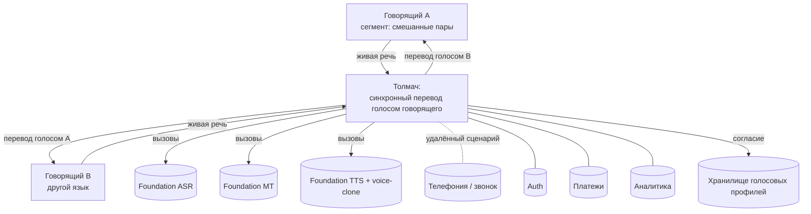

# Worklog — Архитектура (C4 Context) «Толмач»

> Черновик субагента (draft). Источник истины для проекции `3-strategy.md#architecture`.
> Уровень строго **C4 Context**: продукт как один блок, акторы, внешние системы и зависимости.
> Контейнеры/компоненты — шаг 4/позже, здесь их НЕТ (антипаттерн «over-designing»). Всё ниже —
> набросок ⚙️, уточняется на шаге 4. Id не чеканю; развилку не закрываю.

## Проверка предпосылок метода
- **Product concept** (единственная предпосылка SKILL) — **есть**: паспорт `1#concept`/`1#solution`
  даёт конвейер ASR→MT→TTS+voice-clone и задержку ~1.5–2 с. Прогонять `concept-formation` не нужно.
  [sourced: 1-passport #concept, #solution]
- Чего не хватает для полноты (объявляю, не обхожу): устройство-топология сценария (одно устройство
  обслуживает обе стороны vs у каждого своё) не зафиксирована на уровне контекста → влияет на набор
  акторов и на телефонную интеграцию. Помечено `— to clarify —`. [assumption]

## 1 · Система (один блок)
**Толмач** — потребительское приложение синхронного голосового перевода живого разговора: слышит
речь одного говорящего, переводит и произносит её **голосом и интонацией самого говорящего** почти
без задержки (~1.5–2 с). На уровне Context это **один блок** — как он разбит внутри (ASR/MT/TTS —
это контейнеры/пайплайн) НЕ показываем здесь. [sourced: 1-passport #concept, #solution]

## 2 · Акторы (маппинг на сегменты)
- **Говорящий A** и **Говорящий B** — два человека на разных языках, ведущий сегмент **смешанные
  межъязыковые пары** (`1#segments`, приоритет 1 lead). Оба — и источник речи, и слушатель перевода;
  перевод двусторонний по опыту, но, по `1#value-defensibility`, технически **односторонний —
  одно устройство обслуживает обе стороны** (второй стороне то же приложение не обязательно нужно).
  [sourced: 1-passport #segments, #value-defensibility]
- Смежные акторы того же блока (не отдельные роли на Context-уровне): менее tech-savvy старший /
  групповой участник (сегмент «семьи») — усложняют usability, но это тот же актор-«говорящий».
  [sourced: 1-passport #segments]
- ⚙️ **Развилка фронта** (не закрываю): очный сценарий → оба актора физически рядом, один телефон;
  удалённый сценарий → акторы в разных местах, звук идёт через телефонию/звонок. Приоритет фронта —
  открытый вопрос стратегии (`2#to-clarify`: очный vs удалённый). [sourced: 2-analysis #to-clarify]

## 3 · Внешние системы и зависимости
Каждая строка — потенциальная стоимость (→ COGS шаг 4), зависимость (→ риск `R-…`) и возможный
ров/lock-in. Числа стоимости здесь НЕ даю (out of scope, шаг 4).

| Внешняя система | Роль | Cost driver? | Dependency risk? | Moat? |
|-----------------|------|--------------|------------------|-------|
| Foundation-модель ASR (распознавание речи) | речь A → текст | да (COGS, пер-минутно) | да — `R-004` (supplier power big-tech) | нет |
| Foundation-модель MT (перевод) | текст → текст на языке B | да (COGS) | да — `R-004` | нет |
| Foundation-модель TTS + voice-clone (синтез голосом говорящего) | текст перевода → аудио голосом A | да (COGS, тяжелее прочих) | да — `R-004`; здесь же живёт дифференциатор (M2) → зависимость критична | ⚙️ потенциально: сегмент-данные как data-flywheel (`H-013`), но сейчас НЕ ров |
| Телефония / интеграция звонка (удалённый сценарий) | нести аудио обеих сторон в удалённом звонке | средний | ⚙️ средний — платформа/OS/оператор могут не давать вставлять переведённый звук в звонок | ⚙️ потенциально: эксклюзивная интеграция как ров, но не сейчас |
| Аутентификация / identity | вход пользователя, фиксация согласия на голос | малый | низкий | нет |
| Платежи / биллинг | подписка/оплата (модель WTP — развилка шага 3) | малый | средний (провайдер, чарджбэки) | нет |
| Аналитика / продуктовая телеметрия | инструментирование, метрики удержания | малый | низкий | нет |
| Хранилище голосовых профилей | хранить голосовой профиль (по согласию) для voice-clone | малый–средний | да — приватность/регуляторика `R-007` (голос = биометрия в интимных разговорах) | нет |

**Ключевая зависимость (несущая линия набросока).** Ядро продукта (ASR/MT/TTS/voice-clone) стоит
**целиком на внешних foundation-моделях**, принадлежащих big-tech → это стратегический риск
**`R-004`** (supplier power), уже в реестре шага 2. Meta открыл **Seamless** (потоковый перевод +
сохранение голоса, открытые веса) → модели доступны, барьер осуществимости снят публично, но это же
усиливает коммодитизацию (`R-005`) и не снимает зависимость. [sourced: 2-analysis #niche-risks
(R-004, R-005), #competitors (Meta Seamless); founder brief через #concept]

## 4 · Отношения (кто с кем говорит и зачем)
На Context-уровне, текстом:
- Говорящий A → **Толмач**: подаёт живую речь (микрофон / канал звонка). [sourced: 1#solution]
- **Толмач** → foundation-ASR → foundation-MT → foundation-TTS+voice-clone → **Толмач**: конвейер
  распознать→перевести→синтезировать голосом A. (Внутренний порядок — это уже контейнеры; здесь
  фиксируем лишь, что все три вызова уходят во внешние модели.) [sourced: 1#solution]
- **Толмач** → Говорящий B: воспроизводит перевод голосом A (динамик / канал звонка); симметрично для
  реплик B. [sourced: 1#solution]
- **Толмач** ↔ Телефония: в удалённом сценарии звук обеих сторон идёт через звонок/телефонию.
  [sourced: 2#to-clarify (удалённый сценарий)]
- **Толмач** ↔ Auth / Платежи / Аналитика: вход+согласие, оплата подписки, телеметрия. [assumption]
- **Толмач** ↔ Хранилище голосовых профилей: сохраняет/читает голосовой профиль по явному согласию
  (иначе `R-007`). [assumption] (риск-опора — [sourced: 2#niche-risks R-007])

### Набросок Mermaid (Context-уровень)

⚙️ [assumption] — набросок; на шаге 4 уточняется (в т.ч. топология «одно устройство / два»).

## 5 · Развилка «свои модели vs внешние API» — НЕ решаю, возвращаю как опцию
Влияет на `R-004` (зависимость) и на стоимость шага 4. Человек/PO решает.

- **Опция A — внешние foundation-API** (облачные ASR/MT/TTS или размещённый Seamless как сервис).
  + быстрый старт, минимум инфры/команды, свежее качество моделей.
  − `R-004` максимален (supplier power, цена/доступ/политики провайдера), COGS пер-минутно, полная
    экспозиция к коммодитизации (`R-005`). Рва по данным нет.
- **Опция B — свои/дообученные модели** (self-host, в т.ч. от открытых весов Seamless).
  + снижает `R-004`, открывает потенциальный data-flywheel-ров (`H-013`), контроль над voice-clone.
  − тяжёлая инфра/talent-стоимость, обостряет осуществимость `R-003` (задержка+качество своими
    силами), медленный старт.
- **Опция C — гибрид** (внешние API на старте; со временем забрать в дом критичный узел —
  voice-clone/TTS, где живёт дифференциатор M2 и потенциальный ров).
  + баланс скорости и снижения зависимости именно там, где она стратегически важна.
  − миграционная сложность, двойная стоимость в переходный период.
- ⚙️ **Рекомендация субагента (не решение):** **Опция C (гибрид)** — стартовать на внешних API ради
  скорости окна (окно «сужается», `2#opportunity`), но планировать перенос **voice-clone** в дом,
  т.к. именно там дифференциатор и единственный намеченный ров (`H-013`). Развилку закрывает PO по
  данным шагов 3–4. [assumption]

## 6 · Подразумеваемые гипотезы/риски — словами (id чеканит оркестратор)
- **Риск (уже в реестре, подтверждён этим наброском):** зависимость ядра от внешних foundation-моделей
  big-tech → соответствует **`R-004`**; данный контекст показывает, что от неё зависят все три узла
  конвейера. [sourced: 2#niche-risks R-004]
- **Риск (уже в реестре):** захват+хранение голоса (биометрия) в интимных разговорах → **`R-007`**;
  контекст добавляет узел «Хранилище голосовых профилей + согласие» как точку этого риска.
  [sourced: 2#niche-risks R-007]
- **Возможный НОВЫЙ риск (описываю, id не чеканю):** интеграция переведённого звука в **телефонный
  звонок** может быть ограничена платформой/OS/оператором (нельзя вставить свой аудиопоток в звонок) —
  это исполнительский/платформенный риск удалённого сценария, отдельный от `R-004`. Оркестратору
  решить, минтить ли `R-…`. ⚙️ [assumption]
- **Возможная гипотеза (описываю, id не чеканю):** пользователи готовы дать явное согласие на захват
  и хранение своего голосового профиля ради voice-clone (usability/adoption, опора под `R-007`). Если
  согласие — трение, дифференциатор M2 под ударом. Оркестратору решить про `H-…`. ⚙️ [assumption]

## Проекция → `3-strategy.md#architecture`
Ниже — форма фрагмента; оркестратор проецирует, id/подписи ставит сам.

## Architecture (C4 Context) {#architecture}

**System:** ⚙️ **Толмач** — потребительское приложение синхронного голосового перевода живого
разговора голосом самого говорящего (~1.5–2 с задержки), один системный блок. [sourced: 1#concept,
#solution]

**Actors:** ⚙️ Говорящий A и Говорящий B — два человека на разных языках (ведущий сегмент —
смешанные межъязыковые пары, `1#segments`); перевод двусторонний по опыту, технически односторонний
(одно устройство на обе стороны, `1#value-defensibility`). [sourced: 1#segments, #value-defensibility]

**External systems / dependencies:**
| External system | Role | Cost driver? | Dependency risk? | Moat? |
|-----------------|------|--------------|------------------|-------|
| Foundation ASR | речь → текст | да (COGS) | да — `R-004` | — |
| Foundation MT | перевод текста | да (COGS) | да — `R-004` | — |
| Foundation TTS + voice-clone | синтез голосом говорящего | да (COGS, тяжелее) | да — `R-004`, здесь дифференциатор M2 | ⚙️ потенц. (`H-013`), не сейчас |
| Телефония / звонок | аудио удалённого сценария | средний | ⚙️ средний (платформа/OS/оператор) | ⚙️ потенц., не сейчас |
| Auth | вход + согласие | малый | низкий | — |
| Платежи | биллинг подписки | малый | средний | — |
| Аналитика | телеметрия/удержание | малый | низкий | — |
| Хранилище голосовых профилей | голосовой профиль по согласию | малый–средний | да — приватность `R-007` | — |

**Context sketch (Mermaid):** см. §4 воркло́га (Context-уровень, без контейнеров).

**Развилка (НЕ решена):** «свои модели vs внешние API» → A внешние API / B свои модели / C гибрид;
⚙️ рекомендация — C (внешние на старте, voice-clone в дом), влияет на `R-004` и стоимость шага 4 —
решает PO. [assumption]

**Decided:** — to clarify — · **by:** — to clarify — · **alternatives considered:** свои vs внешние
модели (развилка выше, открыта) · ⚙️ набросок субагента, человек не подтверждал.

## Change log
### 2026-08-14 — создан (шаг 3, draft-субагент)
- **From → To:** — → C4 Context набросок «Толмача»: 1 система, 2 актора, 8 внешних систем;
  зависимость ядра от foundation-моделей закреплена как `R-004`, хранение голоса как `R-007`.
- **Why:** дать контекст-набросок для moats/каналов/риска шага 3 и вход в COGS/зависимости шага 4.
- **Trigger:** брифинг оркестратора. Развилка «свои/внешние модели» возвращена открытой; описаны
  один возможный новый риск (телефонная интеграция) и одна возможная гипотеза (согласие на голос) —
  id не чеканил.
